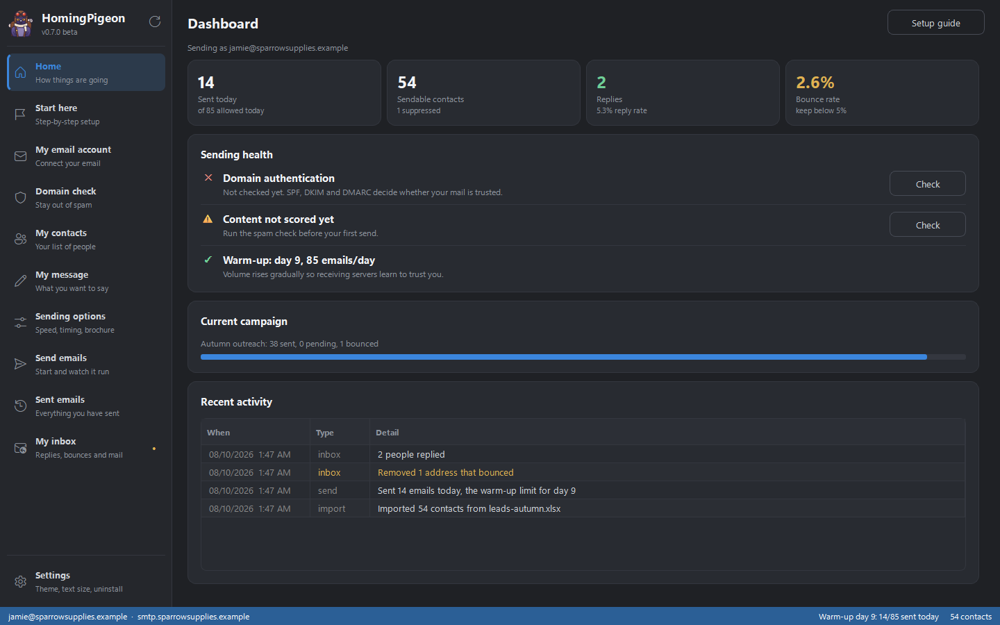
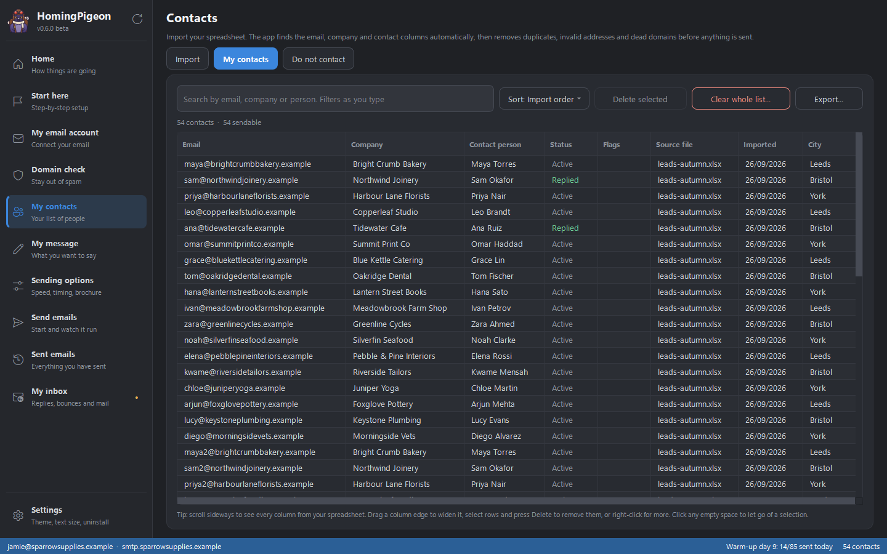
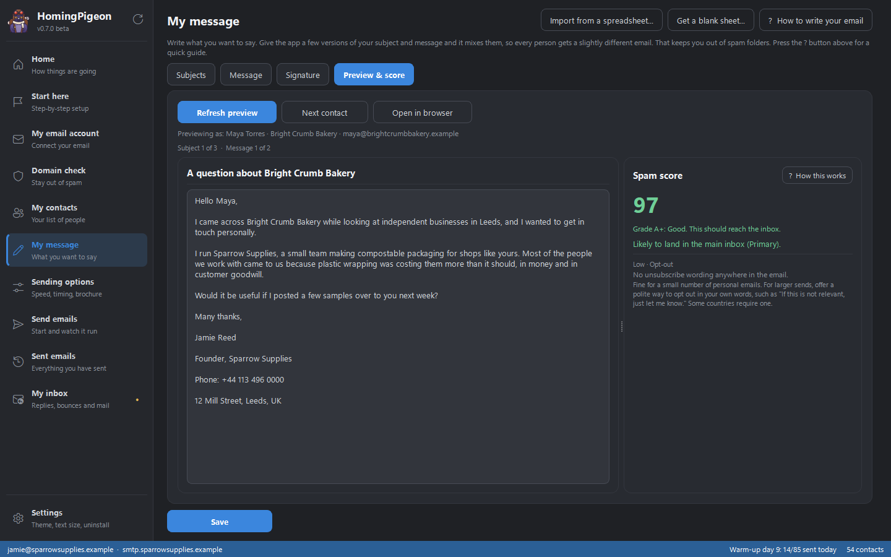
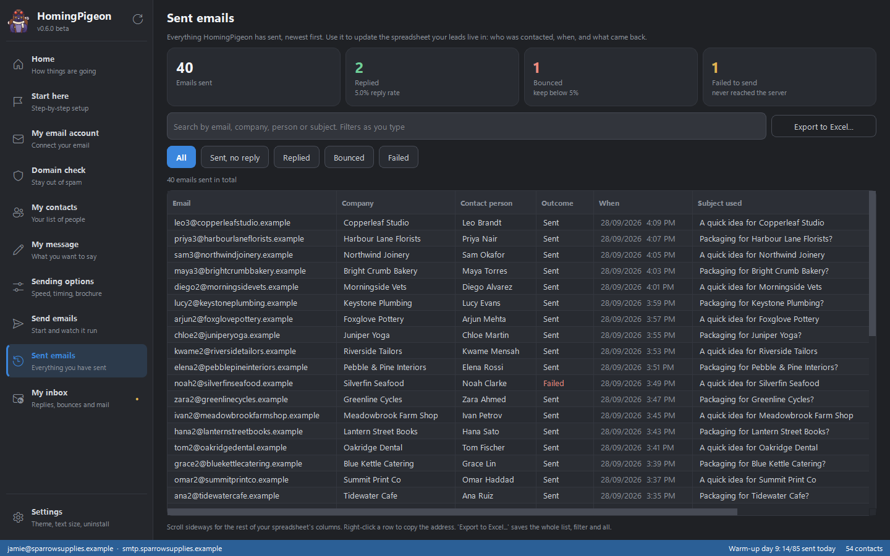
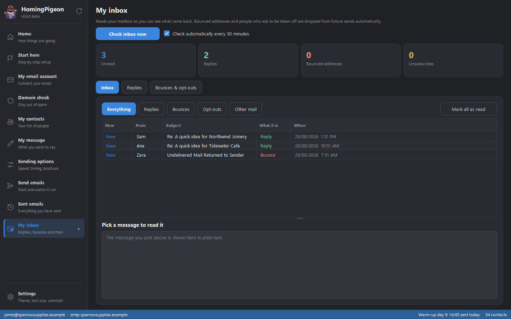
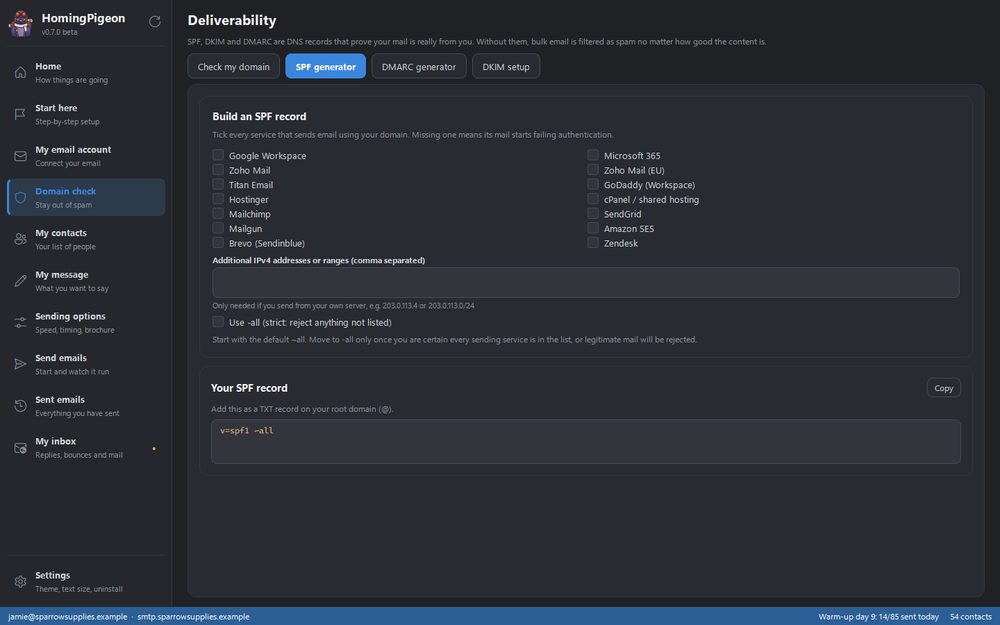
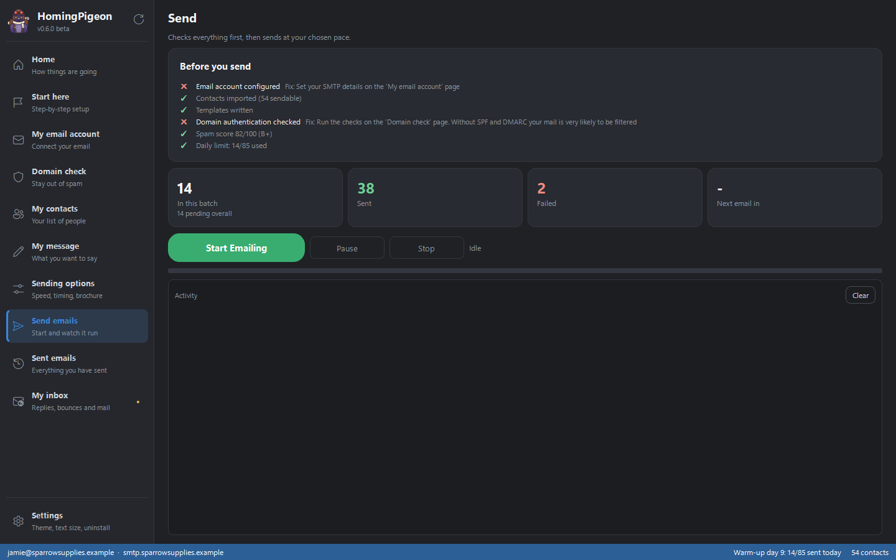
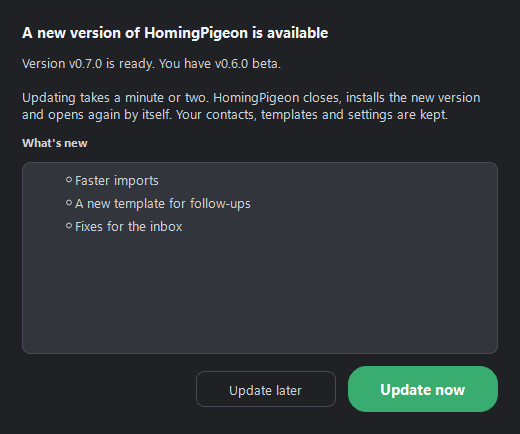
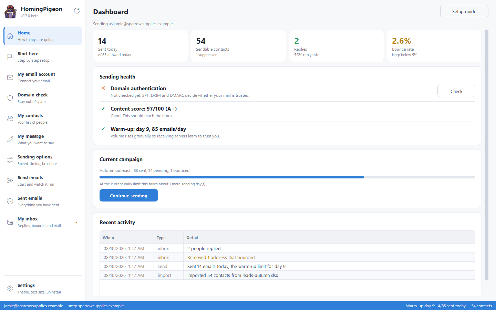

<p align="center">
  
</p>

<h1 align="center">HomingPigeon</h1>

<p align="center"><b>Safe, simple email for your business.</b></p>

Send outreach email to your contact list without landing in the spam folder or getting your
company domain blacklisted.

HomingPigeon does the things that normally go wrong: it checks that your domain is set up
correctly, cleans your contact list before you send, makes every message slightly different,
sends at a human pace, and quietly removes addresses that bounce. It runs on your own computer,
and your contacts never leave it.

**Download:** [latest release](../../releases/latest) · **Version:** 0.6.0 (free beta) ·
**Works on:** Windows, Mac and Linux



> **Free while in beta.** Please [report anything confusing or broken](../../issues/new).

## Features

- **In your language.** English, Arabic, German, Spanish or French, chosen in **Settings**.
  Every page, button and message changes straight away, and Arabic turns the whole app to read
  from right to left. The examples and the unsubscribe line in your emails follow your choice.
- **Updates itself.** When you open the app it checks for a new version. If there is one, a
  popup offers **Update now** or **Update later**. Update now downloads it, checks it is genuine,
  installs it and opens the app again, and your contacts, templates and settings are kept.
- **A setup guide that ticks itself off.** The **Start here** page walks you through every step
  in plain English and marks each one done from the real state of the app, so you always know
  what is left.
- **Domain check, with SPF, DKIM and DMARC generators.** These settings at your domain provider
  prove your email is really from you. Without them your mail is filtered no matter how good it
  is, and Gmail and Yahoo now require them. The app checks yours and writes the records for you.
- **Contact list cleaning on import.** Open an Excel or CSV file and the app finds the email,
  company and contact columns by itself, then removes duplicates, invalid addresses and domains
  with no mail server before anything is sent. Dead addresses bounce, and bounces are the
  fastest way to get blacklisted. Every other column in your sheet is kept, shown in
  **My contacts** and usable in your message as a tag, such as `{{Phone No.}}`.
- **Several subjects and messages.** Write a few versions of each, use tags like
  `{{FirstName}}` and `{{Company}}`, and the app picks a different combination for each person,
  so hundreds of identical emails never go out. Already have them in a spreadsheet? Import the
  subjects and messages in one go.
- **Spam score before you send.** A live preview shows exactly what one contact will receive,
  and the score reads that finished email: subject, message, link, signature and footer
  together. You get a score out of 100, an estimate of whether it lands in the main inbox,
  Gmail's Promotions tab or spam, and plain-English advice on what to change.
- **Examples that reach the main inbox.** Press "Show me an example" for subjects and messages
  written the way personal emails are, and read the guide on keeping out of spam and
  Promotions.
- **A warm-up ramp.** Starts at about 20 emails a day and increases over several weeks. A
  brand-new sender suddenly sending hundreds looks like a hacked account.
- **Human pacing.** A random delay between emails (you set the minimum and maximum), office
  hours only, weekdays only and public holidays skipped. A fixed interval at 3am is an obvious
  sign of automation.
- **An automatic stop.** Sending halts by itself if too many emails start failing, before real
  damage is done to your domain.
- **Bounce and unsubscribe handling.** The app reads your inbox and permanently removes anyone
  who bounced or asked to be removed. You choose whether emails carry an unsubscribe line and
  the one-click unsubscribe header (which puts an Unsubscribe button in Gmail and Outlook).
  Switching them off keeps mail out of Gmail's Promotions tab; replies asking to unsubscribe
  are still handled either way.
- **An inbox you can read.** The **My inbox** page keeps every message the check read, so
  replies, bounces and opt-outs can be opened inside the app instead of only being counted.
- **A record of everything sent.** The **Sent emails** page keeps every message with the time,
  the subject used and whether it was answered, bounced or failed. Double-click one to see the
  email exactly as it went out. The history stays even if you delete the contact; you choose
  what to delete. It also exports back to Excel so your master list stays current.
- **Work while it works.** Importing a large spreadsheet checks every domain in the background,
  so you can set up your account or write your message at the same time.
- **Easy to read.** Dark, light or match-your-computer themes, five text sizes, high contrast
  and bold text, and your choice of date and time format.
- **Backups.** Save everything to one file and restore it later, on this computer or a new one.

## Screenshots

| | |
|---|---|
|  |  |
| **My contacts.** Your imported list, searchable and sortable, with every column from your spreadsheet. | **My message.** A live preview for a real contact, next to the spam score and what to fix. |
|  |  |
| **Sent emails.** Every message that went out, and what came back. Exports to Excel. | **My inbox.** Replies, bounces and opt-outs, readable inside the app. |
|  |  |
| **Domain check.** Checks your domain and writes SPF, DMARC and DKIM records for you. | **Send emails.** A checklist first, then sending at a human pace that you can pause any time. |
|  |  |
| **Automatic updates.** One click to update; the app reopens by itself. | **Light theme.** Or dark, or match your computer, at five text sizes. |

---

## Install on Windows

You don't need to know anything about coding.

1. Go to the **[Releases](../../releases/latest)** page and download **`HomingPigeon-v0.6.0.zip`**.
2. Right-click the downloaded file → **Extract All...** → **Extract**.
3. In the folder that opens, double-click **`HomingPigeon Setup.exe`**.
4. Click **Install**. Setup shows you every step while it works: it downloads what the app needs
   (about 170 MB), checks the download is genuine and sets everything up. Usually about a minute
   on a normal connection.
5. At the end, choose whether to add HomingPigeon to the **Start menu** and the **Desktop**, and
   whether to **open it now**. Click **Finish**.

No administrator password is needed, and nothing else on your computer is changed.

Keep the extracted folder together while you install: Setup uses the `runtime` and `files` folders
next to it. Once the app is installed you can delete the whole folder.

**If Windows shows a warning:**

- **"Windows protected your PC"**: click **More info**, then **Run anyway**.
- **"Smart App Control blocked an app that may be unsafe"** (some Windows 11 PCs): close the
  message and use the backup installer in the same folder instead. Right-click
  **`Install HomingPigeon (if Setup is blocked).bat`** → **Properties** → tick **Unblock** at the
  bottom of the first tab → **OK**, then double-click it. The Unblock tick matters: without it
  Windows blocks the `.bat` as well. The backup installer downloads Python from python.org using
  Windows' own tools, checks it, and opens exactly the same Setup window.

  You can do this once for everyone: tick **Unblock** on the downloaded **`.zip`** the same way
  *before* you extract it, and nothing inside needs unblocking afterwards.

**Updating:** from v0.6.0 on, the app does this for you. When a new version is out, a popup
appears as you open HomingPigeon: click **Update now** and it downloads the update, closes,
installs it and opens again by itself, in a minute or two. Click **Update later** to be asked
next time instead. You can also check any time in **Settings → Updates and help**. Your
contacts, templates and settings are always kept.

If you have v0.5.1 or older, install v0.6.0 once by hand (download it and run its Setup as
above); every update after that is automatic.

**Removing:** Settings → Apps → Installed apps → HomingPigeon → Uninstall, or **Settings →
Uninstall HomingPigeon** inside the app. Your information is kept unless you choose to delete it
too.

---

## Install on Mac or Linux

1. On the **[Releases](../../releases/latest)** page, download **Source code (zip)** and unzip it.
2. Open the folder and double-click the Start file for your computer:

| Your computer | Double-click this file |
|---|---|
| **Mac** | **`Start HomingPigeon - Mac.command`** |
| **Linux** | **`Start HomingPigeon - Linux.sh`** |

The first time, a window opens and gets everything ready (about 2 to 5 minutes). **Keep it open**
and stay connected to the internet; the app opens by itself when it's done. If your computer
doesn't have Python yet, the window offers to install it (Mac) or shows the one command that
installs it (Linux). From then on, the Start file opens the app straight away.

**If your computer shows a warning:**

- **Mac, "cannot be opened" or "Apple could not verify...":** click **Done**, open
  **System Settings → Privacy & Security**, scroll down and click **Open Anyway** next to the
  message about the Start file. On older Macs, **right-click** the file and choose **Open**.
- **Linux, the file opens in a text editor:** right-click it → **Properties** → **Permissions**
  → tick **Allow executing file as program**, then double-click it again.

---

## Using the app

The very first time it opens, everything is empty. Go to the **Start here** page inside the app
and follow it from the top. It walks you through every step and ticks them off as you go.

**Everything you type is saved automatically.** Close the app and open it again, and your email
settings, templates and contacts are all still there. You only set it up once.

---

## Where your information is kept

Your settings, contacts and templates live in a folder separate from the app, so updating or
removing the app **never touches your data**:

| Computer | Folder |
|---|---|
| Windows | `C:\Users\<your name>\AppData\Roaming\HomingPigeon` |
| Mac | `~/Library/Application Support/HomingPigeon` |
| Linux | `~/.local/share/HomingPigeon` |

Your email password is stored encrypted. On Windows it uses Windows' own protection (DPAPI), so
it can only be read by your Windows account on your computer. It is never sent anywhere.

The program itself has its own folder with a private copy of Python that only HomingPigeon uses,
so it never interferes with other programs (on Windows:
`C:\Users\<your name>\AppData\Local\Programs\HomingPigeon`).

---

## Frequently asked

**Setup stopped part-way.**
Nothing is broken. Check your internet connection and click **Try again** (or run Setup again),
it keeps what was already done and picks up where it left off. The **Open log file** button shows
exactly what happened.

**Do I need a website or a company domain?**
You need an email address on your own domain (like `you@yourcompany.com`). Sending business
outreach from a free Gmail or Hotmail address gets filtered much harder, and you cannot prove
ownership of it.

**My password doesn't work.**
If your email has two-factor authentication (most do), you need an **app password** rather than
your normal one. The app tells you exactly where to get it for your provider: Gmail, Microsoft
365, Zoho and others all have presets.

**How many emails can I send?**
The app starts you at roughly 20 a day and increases gradually. This is deliberate. Sending
more, faster, is how domains get blacklisted, and a blacklisted domain can break your normal
business email too, not just your outreach.

**Can I attach a brochure or document?**
Yes, up to 2 MB, but the app defaults to a *link* instead, because attachments from unknown
senders are one of the strongest spam signals there is.

**Is my contact list uploaded anywhere?**
No. Everything stays on your computer. The app only talks to your own email provider and to
public DNS (to check your domain settings).

---

## For developers

The interface is PyQt6. It is split so that the parts that can block never share a
thread with the parts that draw.

```
run.py                     app entry point: QApplication, theme, main window
app/config.py              app name, version, paths, limits

app/core/                  the engine, and the only place business rules live.
                           Pure Python with no UI imports at all, so it can be
                           tested and called from a worker thread unchanged:
                           db, importer, merge, composer, sender, scorer, warmup,
                           imap_sync, dns_tools, exporter, credentials, shortcut, tls

app/workers/               everything slow, moved off the UI thread
  base.py                  Task / Worker on a QThreadPool, results delivered by signal
  jobs.py                  one wrapper per slow job (SMTP, IMAP, DNS, Excel, scoring)
                           plus SendPump, which turns the send worker's event queue
                           into Qt signals

app/models/                QAbstractTableModel implementations
  contacts_model.py        paged straight from SQLite, so a huge list opens instantly
  sent_model.py            the same paging over what has actually been sent
  table_model.py           small in-memory tables (activity, suppression, replies)

app/services/              app management that is neither UI nor business logic
  maintenance.py           backup, restore, restart, uninstall, version comparison
  updater.py               finds a newer release on GitHub, downloads and checks it,
                           and hands over to the installer's --update mode

app/ui/
  theme.py                 tokens and the whole application stylesheet
  main_window.py           sidebar, page stack, status bar
  pages/                   one module per page, built on first use
  widgets/                 shared building blocks: cards, buttons, tables, dialogs,
                           inputs (including the typing debouncer), the range slider
                           and the "new version available" popup

assets/                    logo.svg and the icons rendered from it
installer/setup_app.py     the Windows installer (becomes "HomingPigeon Setup.exe")
installer/install-if-blocked.bat   backup installer for Smart App Control PCs
tools/build_installer.py   builds Setup.exe and the release zip
tools/make_icons.py        re-renders assets/ after changing logo.svg
tools/launch.py            used by the Mac and Linux "Start HomingPigeon" files
tools/take_screenshots.py  renders docs/screenshots/ from made-up sample data
tests/                     pytest suite
```

Three rules keep the window responsive:

- **Nothing slow runs on the UI thread.** SMTP, IMAP, DNS lookups, reading a
  spreadsheet and spam scoring all go through `app/workers/`, which reports back
  with `pyqtSignal`. Qt delivers those on the main thread, so the callbacks can
  touch widgets safely.
- **Appearance changes restyle, they never rebuild.** Theme, contrast and bold
  text re-render one QSS string and hand it to Qt. No widget is destroyed, which
  is what made the old build stutter on every settings change.
- **Work is done once the user stops typing.** Anything expensive driven by a
  text field goes through `Debouncer` in `app/ui/widgets/inputs.py`.

Pages are constructed the first time they are opened, not at startup, so the
window appears with a single page in it.

**Picking the project up again (or handing it to Claude)?** Start with
[`docs/handover/README.md`](docs/handover/README.md). It explains how the pieces fit together,
the rules that must not be broken, where each feature lives and what changed in each release.

`requirements.txt` is what the app needs to run. `requirements-dev.txt` adds the build and test
tools:

```
pip install -r requirements-dev.txt
python run.py
python -m pytest tests/ -q
```

Test sending without emailing anybody real. Start a local mail server that accepts and discards
everything:

```
python -m aiosmtpd -n -l localhost:1025
```

Then in the app set the server to `localhost`, port `1025`, security **None (testing only)**.

### Making a release

1. Change `APP_VERSION` in `app/config.py` (for example to `"v0.6.0 beta"`), commit and push.
2. On GitHub: **Releases → Draft a new release**. Under **Choose a tag**, type the version
   (`v0.6.0`) and pick **Create new tag on publish**. Give it a title and notes, then **Publish**.
3. GitHub Actions builds `HomingPigeon-v0.6.0.zip` and attaches it to the release by itself
   (about 5 minutes, watch progress in the **Actions** tab).

Installed copies notice the new release the next time they open. Until the zip is attached,
their popup's **Update now** opens the release page instead of updating, so nothing breaks while
the build is still running.

To build it on your own PC instead: `python tools/build_installer.py`, then drag
`dist\HomingPigeon-v0.6.0.zip` into the release's **Attach binaries** box.

## A note on DKIM

The app can generate a DKIM key pair, but that is **only usable if you run your own mail
server**. On Google Workspace, Microsoft 365, Zoho or normal web hosting, your provider holds
the signing key, so for those the app shows the exact steps to switch it on in their control
panel instead. See **Deliverability → DKIM setup** in the app.

## Licence and responsibility

You are responsible for who you email and for following the law where you and your recipients
live (GDPR, CAN-SPAM, and similar). This tool helps you send responsibly. It does not make
unsolicited email legal. Always honour unsubscribe requests immediately; the app does this
automatically if you let it.
